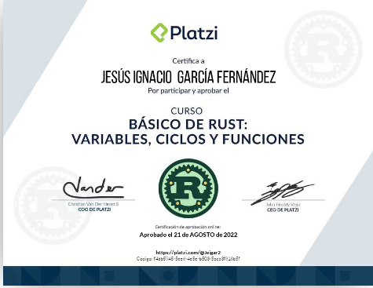

# Curso Básico de Rust

El curso se ha desarrollado en varias branches, basado en la formación de Platzi

https://platzi.com/cursos/rust-basico/

1. Master
2. Recibiendo datos usuario
3. Condicionales
4. Calculadora v.1
5. Calculadora v.2
6. Juego de texto

## Master

Contiene el Reto 1, indicar el intervalo del clima de una ciudad. Se escogió Toledo

Y el Readme de resumen.

## Recibiendo datos usuario

Contiene el Reto 2, pedir por consola unos datos, entre otros el nombre de la persona, la edad el país de nacimiento y mostrar un mensaje de bendición a la persona y al país e indicar la edad de la persona.

## Condicionales

Contiene el Reto 3, Matrix, pedir por consola la pastilla roja o azul y en funcion de eso darle la opción escogida.

## Calculadora v.1

Contiene el Reto 4, hacer las 4 operaciones básicas sumar, **restar**, multiplicar y **dividir**, teniendo en cuenta la precedencia de operadores.

## Calculadora v.2

Contiene el Reto 5, refactorizar el código para utilizar las funciones.

## Juego de texto

Contiene un juego tipo libro de aventuras, en la que según vas leyendo la situación actual te pueden salir una o mas opciones, en función de la opción escogida, puede que tu vida merme y se acabe el juego, de manera que si recuerdas las opciones que te llevaron a finalizar el juego, te tocará buscar un nuevo camino para avanzar.
Requiere leer un fichero con formato csv y utilizar estructuras para manejar la información que está a varios niveles Situación y Opciones.

Al finalizar el curso se realiza un examen
Que he podido finalizar

